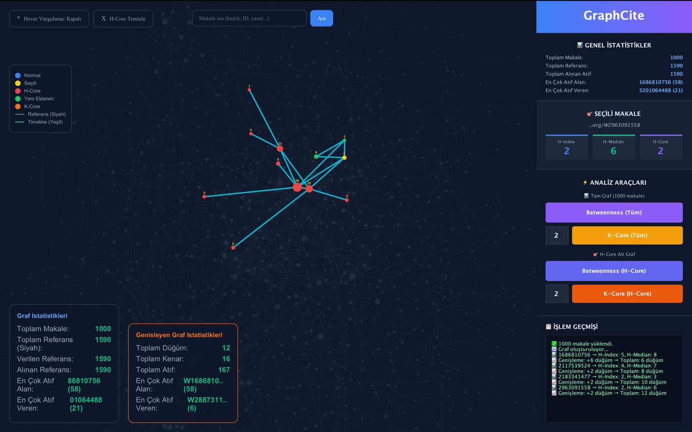

# GraphCite — Citation Graph Analysis System

GraphCite is a Java desktop application for exploring citation networks between academic papers, combining graph algorithms with an interactive, web-based visualization embedded in a native UI.

## 📸 Screenshots

### 🖥️ Citation Graph Visualization



---

## Features

- **Custom JSON ingestion** — a purpose-built parser reads thousands of article records from `data.json` and converts them into in-memory graph models.
- **Interactive citation graph visualization** — instead of a heavyweight desktop graphics toolkit, the graph is rendered with D3.js inside a JavaFX `WebView`, giving a smooth, zoomable, drag-and-drop graph experience embedded in a Swing window.
- **Citation metrics:**
  - **In-Degree** — how many times a paper has been cited.
  - **H-Index** — impact score derived from the citation counts of citing papers.
  - **H-Core** — the set of papers that constitute a node's H-Index.
  - **H-Median** — the median citation count within the H-Core set.
- **Live drill-down** — clicking any article node dynamically expands its H-Core subgraph and streams detailed statistics/logs to a side panel.

## Tech Stack

| Layer | Technology |
| --- | --- |
| Language | Java 17 |
| Build | Maven |
| Desktop UI | Java Swing, hybrid with JavaFX `WebView` |
| Graph rendering | HTML5 Canvas + D3.js |
| Logging | SLF4J + Logback |

## Project Structure

```text
GraphCite/
├── pom.xml
├── data.json                          # Article/citation dataset
└── src/
    └── main/
        ├── java/com/kocaeli/graphcite/
        │   ├── graph/                 # H-Index, H-Core, In-Degree algorithms
        │   ├── model/                 # Article data models
        │   ├── parser/                # Custom JSON parser
        │   └── ui/                    # Swing panels + WebView integration (MainApp entrypoint)
        └── resources/web/             # D3.js graph visualization assets (HTML/JS)
```

## Getting Started

### Prerequisites

- JDK 17 or newer
- Apache Maven

### Build and run

```bash
git clone https://github.com/dilaydikbiyik/GraphCite.git
cd GraphCite
mvn clean install
mvn javafx:run
```

Alternatively, run `com.kocaeli.graphcite.ui.MainApp` directly from your IDE.

## Usage

1. On launch, the app loads the citation dataset and renders the full graph.
2. Use the mouse to zoom, pan, or drag individual nodes.
3. Click any article node to:
   - View its H-Index and H-Median in the stats panel on the right.
   - Highlight the other articles in its H-Core set, expanding the graph around it.

## Contributing

Pull requests are welcome — particularly around parser performance, additional citation metrics, or UI polish. Please open an issue to discuss significant changes first.

## License

No license specified yet.
